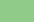
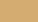
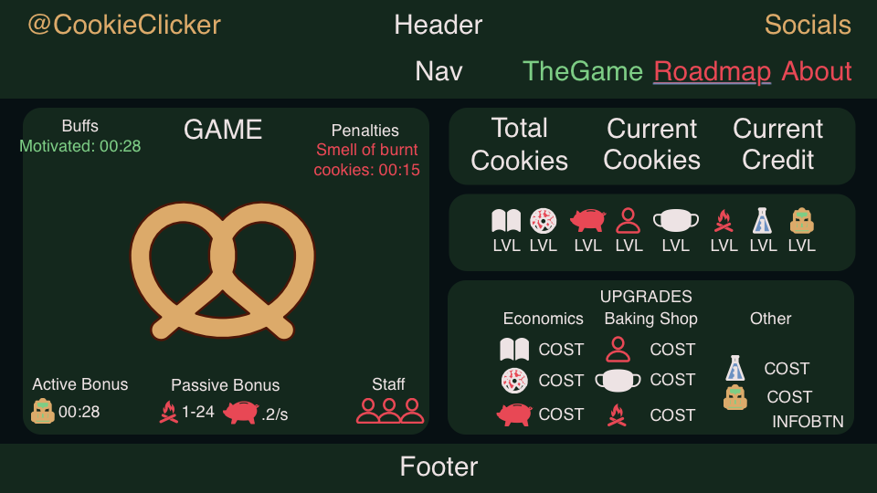

## Cookie Clicker ##
[Play now!](https://yasserb94.github.io/CookieClicker/);

This project came to be as a 2 day [BeCode](https://becode.org) assignment to improve my JavaScript ES6 skills,learn about incremental games/js features and have some creative fun!

Due to the challenge I will focus on making this game work on a desktop computer, improving the UI responsiveness for mobile will be one of the last stretchgoals.
Making the game work and have some fun features will be my priority.
### Goals ###
- [ ] Have a basic site that houses the game
- [ ] Have a clickable cookie and a visible score/credit count
- [ ] Have a store with upgrades
  - [ ] Make upgrades cost points
  - [ ] Have a passive income upgrade
  - [ ] Make upgrades upgradeable with increased cost
  - [ ] Have an upgrade that increases cookies gained per click for a set amount of time
  - [ ] You can't buy upgrades if you can't afford them
- [ ] Make it pretty
#### Stretch Goals ####
- [ ] Add a bloglike page to the site that has a roadmap of how the game came to be
- [ ] Add an about/contact page
- [ ] Use acutal cookies(?) to keep player's score stored
- [ ] Make the site responsive
- [ ] Implement Upgrade ideas
#### Roadmap ####
- [X] Have a design for the website
  - [X] Have a cookie friendly color palette
    - [X] Primary Color             Color: **#E84855**
    - [X] Secondary Color           Color: **#6C91C2**
    - [X] Accent/Highlight Color    Color: **#7DCD85**
    - [X] Dark Background Color     Color: **#14281D**
    - [X] Replacement for black     Color: **#071013**
    - [X] Replacement for white     Color: **#EDE3E4**
    - [X] Dark Cookie Color         Color: **#4D1607**
    - [X] Light Cookie Color        Color: **#DCAA6A**
  - [X] Have a sketch for the home-page that houses the game

- [X] Create the design in html and css
- [X] Add a cookie to the page
- [X] Add a dedicated spot to display total cookies baked
- [ ] Start the JS logic of the game
  - [ ] Implement a game update loop to prepare for logic
    - [ ] Seperate update to logic from UI update
  - [ ] Make the cookie clickable
    - [ ] Add a counter to count amount of cookies baked

- [ ] Upgrade Ideas
  - [ ] The user sells a cookie every x seconds and gains money to buy upgrades instead of using cookies
    - [ ] Study Economy -> Cookies are converted to money quicker (Better business plan, more sales)
    - [ ] Improve Recipe -> Cookies are converted to more money (Nicer cookies, larger price)
    - [ ] Invest -> The user invests its current money and will get a passive money income
  - [ ] Hire staff the user gets a helper that bakes cookies in a passive manner Tough good work aint cheap and cheap work aint good, *So tip your bartender!*
    - [ ] Upgrade staff -> Train staff/hire someone better that has less chance of burning a cookie
    - [ ] Improve Work conditions -> Staff will bake at a faster rate
    - [ ] Possible debuff! The staff spills and ruins a batch of cookies in the shop - halves the cookies you bake for a bit
    - [ ] Possible buff! The staff motivates you and gives you x seconds chance of double cookies\
    - [ ] Multiple staff members ??
  - [ ] The user bakes cookies by clicking
    - [ ] Improve baking skills -> Less chance to burn a cookie
    - [ ] Improve Oven -> Amount of cookies that make it into the store has the chance to be a higher number
    - [ ] Holiday -> No cookies can be sold/made for x time, but when the time ends you get double sales and double cookies baked for x seconds(Battery recharged!)
