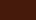
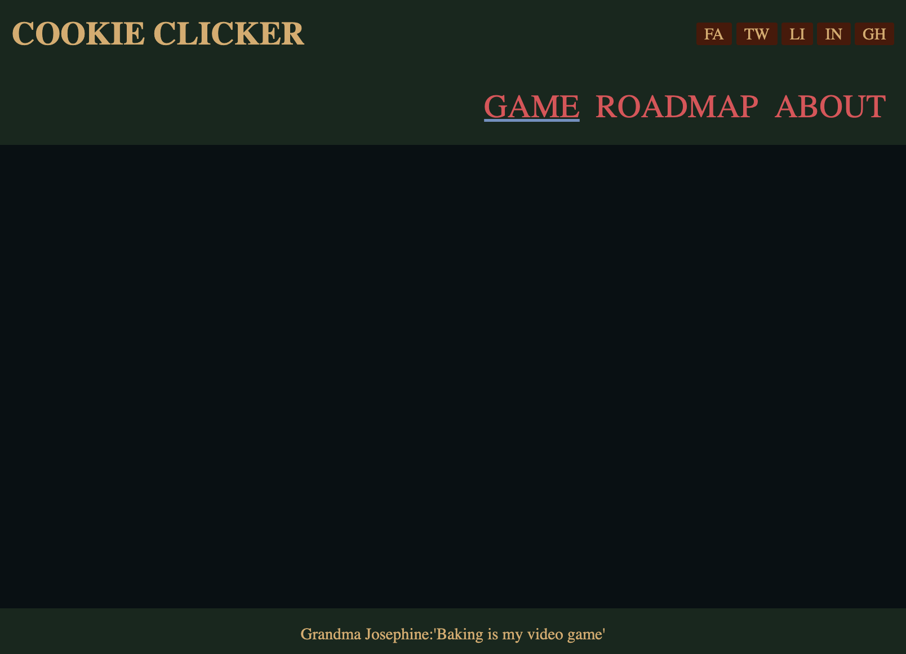

## Cookie Clicker ##
[Play now!](https://yasserb94.github.io/CookieClicker/);

This project came to be as a 2 day [BeCode](https://becode.org) assignment to improve my JavaScript ES6 skills,learn about incremental games/js features and have some creative fun!

Due to the challenge I will focus on making this game work on a desktop computer, improving the UI responsiveness for mobile will be one of the last stretchgoals.
Making the game work and have some fun features will be my priority.
### Goals ###
- [X] Have a basic site that houses the game
- [x] Have a clickable cookie and a visible score/credit count
- [x] Have a store with upgrades
  - [x] Make upgrades cost points
  - [X] Have a passive income upgrade
    - [X] In form of staff
    - [ ] In form of interest
  - [x] Make upgrades upgradeable with increased cost
  - [x] Have an upgrade that increases cookies gained per click for a set amount of time
  - [x] You can't buy upgrades if you can't afford them
- [ ] Make it pretty
#### Stretch Goals ####
- [ ] Add a bloglike page to the site that has a roadmap of how the game came to be
- [ ] Add an about/contact page
- [ ] Use acutal cookies(?) to keep player's score stored
- [ ] Make the site responsive
- [X] Implement Upgrade ideas
#### Roadmap ####
- [X] Have a design for the website
  - [X] Have a cookie friendly color palette
    - [X] Primary Color             Color: **#E84855**
                        - 
    - [X] Secondary Color           Color: **#6C91C2**
                        - 
    - [X] Accent/Highlight Color    Color: **#7DCD85**
                        - 
    - [X] Dark Background Color     Color: **#14281D**
                        - 
    - [X] Replacement for black     Color: **#071013**
                        - 
    - [X] Replacement for white     Color: **#EDE3E4**
                        - 
    - [X] Dark Cookie Color         Color: **#4D1607**
                        - 
    - [X] Light Cookie Color        Color: **#DCAA6A**
                        - 
  - [X] Have a sketch for the home-page that houses the game

- [X] Create the design in html and css

- [X] Create the base site layout in html/css
- [X] Create the game section
- [X] Add a cookie to it's game panel
- [X] Add a cookie click counter to it's game panel

- [X] JS logic of the clicker
  - [X] Implement a game update loop to prepare for logic
    - [X] Ask the browser when it can update the game
    - [X] Configure the game to update once/second
	can be modified with a variable: FPS
    - [X] Seperate update to logic from UI update
	split in two functions: update() and draw()
  - [X] Make the cookie clickable
    - [X] Add a counter to count amount of cookies baked
- [X] Add logic to sell shop cookies and convert to credits
  - [X] set cookieprice and sell a cookie every x random seconds
  - [ ] implement upgrade to get more money per cookie sold
  - [X] implement upgrade to sell cookies faster
- [x] Display values in a panel

- [X] Add some sort of multiplier
  - [X] Add oven option to upgrade-shop pane
  - [X] Add oven level indicator to upgrade-stats pane
  - [X] Add price to oven upgrade
  - [X] Make cookie clicker increase cookies per click based on oven level

- [X] Add Economics upgrade
  - [X] Sell more cookies at a time
  - [X] Added extra check to make sure there are enough cookies

- [X] Add a Find Staff upgrade
  - [X] Have random staff members with random skills and moobs
  - [X] Generate new staff if staff members run low
  - [X] Have a x chance to hire a staff member
  - [X] Increase hiring chance dependent on investment 
  - [X] Let staff members bake cookies
  - [X] Add cookies baked/min by staff to info
  - [x] Have funny names for newly generated staff

- [X] Add Cookie Quality Upgrade
  - [X] Earn tips, the user has a small chance to gain an extra credit/cookie sold
  - [X] Tip chance gets increased if the cookie's recipe is upgraded

- [X] Rent an extra oven!
  - [X] Staff members will use the upgraded oven instead of their own
  - [X] The oven can be rented for a set amount of time
  - [X] Price for renting depends on the amount of staff members in the shop

- [X] Make Staff sell cookies
  - [x] Staff will sell cookies isntead of baking
  - [x] Add a new characteristic to staff members that determines how many cookies they sell/loop
  - [x] the more money the user has the more money the staff wants to start baking again

- [X] Have panes explaining the game and upgrades to new players
- [x] Have some juicy stats
- [x] Have indicators for the staffs current job and the oven boost

